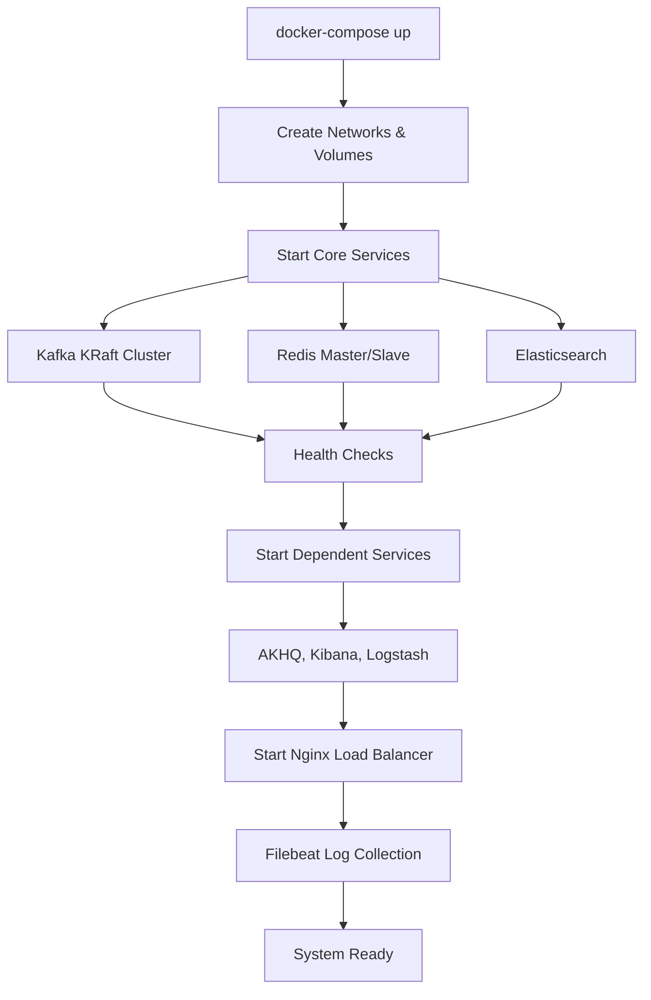
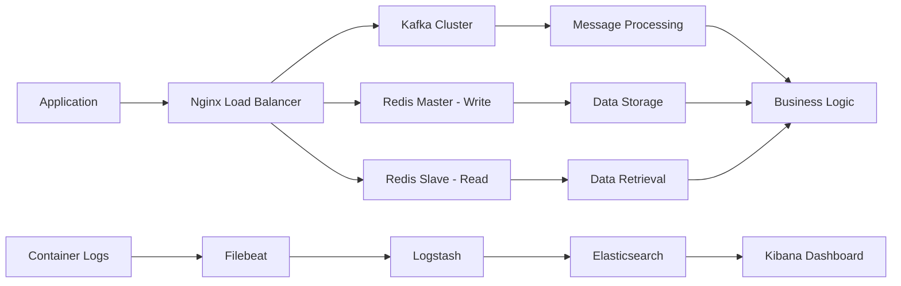

# ContextChain Infrastructure

Hệ thống infrastructure hoàn chỉnh cho ContextChain với Kafka, Redis, ELK Stack và Nginx Load Balancer, được thiết kế để xử lý dữ liệu phân tán với hiệu suất cao.

## 🏗️ Kiến trúc tổng quan

```
┌─────────────────────────────────────────────────────────────────┐
│                        NGINX LOAD BALANCER                      │
│  ┌─────────┬─────────┬─────────┬─────────┬─────────┬─────────┐  │
│  │HTTP:80  │AKHQ:8080│Kibana   │Redis    │Kafka    │Logs     │  │
│  │HTTPS:443│         │:5601    │W:6379   │:9092    │:5044    │  │
│  │         │         │ES:9200  │R:6380   │:9093    │:5001    │  │
│  └─────────┴─────────┴─────────┴─────────┴─────────┴─────────┘  │
└─────────────────────────────────────────────────────────────────┘
                                │
        ┌───────────────────────┼───────────────────────┐
        │                       │                       │
┌───────▼────────┐    ┌─────────▼────────┐    ┌────────▼────────┐
│   KAFKA CLUSTER │    │  REDIS CLUSTER   │    │   ELK STACK     │
│                 │    │                  │    │                 │
│ ┌─────────────┐ │    │ ┌──────────────┐ │    │ ┌─────────────┐ │
│ │ Kafka Broker│ │    │ │Redis Master  │ │    │ │Elasticsearch│ │
│ │ (KRaft Mode)│ │    │ │(Write Ops)   │ │    │ │             │ │
│ │             │ │    │ │DB:cortext_   │ │    │ │             │ │
│ │ - PLAINTEXT │ │    │ │   redis      │ │    │ │             │ │
│ │ - SASL      │ │    │ └──────────────┘ │    │ └─────────────┘ │
│ │ - EXTERNAL  │ │    │ ┌──────────────┐ │    │ ┌─────────────┐ │
│ └─────────────┘ │    │ │Redis Slave   │ │    │ │ Logstash    │ │
│ ┌─────────────┐ │    │ │(Read Ops)    │ │    │ │             │ │
│ │AKHQ Web UI  │ │    │ │DB:cortext_   │ │    │ │             │ │
│ │             │ │    │ │   redis      │ │    │ │             │ │
│ └─────────────┘ │    │ └──────────────┘ │    │ └─────────────┘ │
│ ┌─────────────┐ │    └──────────────────┘    │ ┌─────────────┐ │
│ │Kafka        │ │                            │ │ Kibana      │ │
│ │Exporter     │ │                            │ │             │ │
│ └─────────────┘ │                            │ └─────────────┘ │
└─────────────────┘                            │ ┌─────────────┐ │
                                               │ │ Filebeat    │ │
                                               │ │             │ │
                                               │ └─────────────┘ │
                                               └─────────────────┘
```

## 🔄 Lifecycle và hoạt động

### 1. **Khởi động hệ thống (Startup Lifecycle)**



**Thứ tự khởi động:**
1. **Infrastructure Layer**: Networks, Volumes
2. **Core Services**: Kafka, Redis Master, Elasticsearch
3. **Dependent Services**: Redis Slave, Logstash, AKHQ, Kafka Exporter
4. **Presentation Layer**: Kibana, Nginx
5. **Monitoring Layer**: Filebeat

### 2. **Data Flow Architecture**



### 3. **Service Communication Flow**

#### **Kafka Message Flow:**
```
Producer → Nginx:9092/9093 → Kafka Broker → Consumer
                ↓
        AKHQ Web UI (Monitoring)
                ↓
        Kafka Exporter → Prometheus Metrics
```

#### **Redis Data Flow:**
```
Write Operations: Client → Nginx:6379 → Redis Master → Replication → Redis Slave
Read Operations:  Client → Nginx:6380 → Redis Slave
```

#### **Logging Flow:**
```
Container Logs → Filebeat → Logstash:5044 → Elasticsearch → Kibana:5601
TCP/UDP Logs → Logstash:5001 → Elasticsearch → Kibana:5601
```

## 🚀 Cách setup

### **Bước 1: Chuẩn bị môi trường**

```bash
# Kiểm tra Docker và Docker Compose
docker --version
docker-compose --version

# Clone hoặc tạo thư mục dự án
mkdir contextchain-infrastructure
cd contextchain-infrastructure

# Copy docker-compose.yml và paste.txt, paste-2.txt vào thư mục
```

### **Bước 2: Chạy script setup**

```bash
# Cấp quyền thực thi cho setup script
chmod +x setup.sh

# Chạy script để tạo tất cả config files
./setup.sh
```

Script sẽ tạo các thư mục và files sau:
```
contextchain-infrastructure/
├── docker-compose.yml
├── setup.sh
├── nginx/
│   └── nginx.conf
├── redis/
│   ├── redis-master.conf
│   └── redis-slave.conf
├── kafka/
│   └── client.properties
├── logstash/
│   ├── config/
│   │   └── logstash.yml
│   └── pipeline/
│       └── logstash.conf
└── filebeat/
    └── filebeat.yml
```

### **Bước 3: Khởi động hệ thống**

```bash
# Khởi động tất cả services
docker-compose up -d

# Theo dõi logs
docker-compose logs -f

# Kiểm tra trạng thái services
docker-compose ps
```

### **Bước 4: Xác minh hoạt động**

#### **Health Checks:**
```bash
# Kiểm tra tổng quan
curl http://localhost/health

# Kiểm tra Kafka
curl http://localhost:8080  # AKHQ Web UI

# Kiểm tra Elasticsearch
curl http://localhost:9200/_cluster/health

# Kiểm tra Redis Master (Write)
redis-cli -h localhost -p 6379 ping

# Kiểm tra Redis Slave (Read)
redis-cli -h localhost -p 6380 ping
```

#### **Test Data Flow:**

**Kafka Test:**
```bash
# Tạo topic
docker exec contextchain-kafka kafka-topics.sh \
  --create --topic test-topic --bootstrap-server localhost:9092

# Producer test
docker exec -it contextchain-kafka kafka-console-producer.sh \
  --topic test-topic --bootstrap-server localhost:9092

# Consumer test (terminal khác)
docker exec -it contextchain-kafka kafka-console-consumer.sh \
  --topic test-topic --bootstrap-server localhost:9092 --from-beginning
```

**Redis Test:**
```bash
# Test Write (Master)
redis-cli -h localhost -p 6379 set test:key "Hello ContextChain"

# Test Read (Slave)
redis-cli -h localhost -p 6380 get test:key
```

## 🎯 Service Endpoints

### **Web Interfaces:**
| Service | URL | Mô tả |
|---------|-----|-------|
| Main Portal | http://localhost | Trang chủ chuyển hướng |
| AKHQ (Kafka UI) | http://localhost:8080 | Quản lý Kafka |
| Kibana | http://localhost:5601 | Dashboard và logs |
| Elasticsearch | http://localhost:9200 | API và cluster info |
| Health Check | http://localhost/health | Kiểm tra hệ thống |

### **TCP Services:**
| Service | Port | Mô tả |
|---------|------|-------|
| Redis Write | 6379 | Master - Write operations |
| Redis Read | 6380 | Slave - Read operations |
| Kafka PLAINTEXT | 9092 | Kafka không authentication |
| Kafka SASL | 9093 | Kafka với SASL authentication |
| Kafka External | 29092 | External access |
| Logstash Beats | 5044 | Filebeat input |
| Logstash TCP | 5001 | TCP/UDP log input |

## 📊 Monitoring và Logs

### **View Logs:**
```bash
# Tất cả services
docker-compose logs -f

# Service cụ thể
docker-compose logs -f kafka
docker-compose logs -f redis-master
docker-compose logs -f elasticsearch

# Real-time logs
docker-compose logs -f --tail=100 nginx
```

### **Kibana Dashboard:**
1. Truy cập: http://localhost:5601
2. Index Pattern: `contextchain-logs-*`
3. Time field: `@timestamp`
4. Khám phá logs theo tags: `docker`, `kafka`, `redis`, `nginx`

### **Resource Monitoring:**
```bash
# Container stats
docker stats

# Service health
docker-compose ps

# Disk usage
docker system df
```

## 🛠️ Troubleshooting

### **Common Issues:**

**1. Port conflicts:**
```bash
# Kiểm tra ports đang sử dụng
netstat -tulpn | grep :80
lsof -i :6379

# Thay đổi ports trong docker-compose.yml nếu cần
```

**2. Memory issues:**
```bash
# Kiểm tra memory usage
docker stats --no-stream

# Tăng memory limits trong docker-compose.yml
```

**3. Service không start:**
```bash
# Kiểm tra logs
docker-compose logs [service-name]

# Restart service
docker-compose restart [service-name]

# Recreate service
docker-compose up -d --force-recreate [service-name]
```

**4. Redis replication issues:**
```bash
# Kiểm tra replication status
redis-cli -h localhost -p 6379 info replication
redis-cli -h localhost -p 6380 info replication
```

**5. Kafka connectivity:**
```bash
# Test SASL connection
kafka-console-consumer.sh --bootstrap-server localhost:9093 \
  --consumer.config /opt/bitnami/kafka/config/client.properties \
  --topic test --from-beginning
```

## 🔧 Configuration

### **Redis Database:**
- **Database Name**: `cortext_redis`
- **Master**: Write operations, port 6379
- **Slave**: Read operations, port 6380
- **Persistence**: RDB + AOF enabled
- **Memory Policy**: allkeys-lru (512MB limit)

### **Kafka:**
- **Mode**: KRaft (no Zookeeper)
- **Authentication**: SASL_PLAINTEXT
- **Credentials**: admin/123456A@a
- **Compression**: LZ4
- **Listeners**: PLAINTEXT:9092, SASL:9093, EXTERNAL:29092

### **ELK Stack:**
- **Elasticsearch**: Single node, no security
- **Logstash**: Multi-input (Beats, TCP, UDP)
- **Kibana**: Connected to Elasticsearch
- **Filebeat**: Docker container logs collection

## 🛑 Shutdown

```bash
# Graceful shutdown
docker-compose down

# Remove volumes (careful - deletes data!)
docker-compose down -v

# Remove everything including images
docker-compose down -v --rmi all
```

## 📈 Performance Tuning

### **Production Recommendations:**

1. **Resource Limits**: Tăng memory/CPU limits
2. **Security**: Enable authentication cho tất cả services
3. **Monitoring**: Thêm Prometheus + Grafana
4. **Backup**: Thiết lập backup strategy cho Redis và Elasticsearch
5. **Clustering**: Scale thành multi-node cluster
6. **SSL/TLS**: Enable encryption cho external connections

### **Scaling Options:**

```yaml
# Multi-instance scaling
deploy:
  replicas: 3
  resources:
    limits:
      memory: 4G
      cpus: '2.0'
```

---

🎉 **ContextChain Infrastructure sẵn sàng cho production workloads!**
